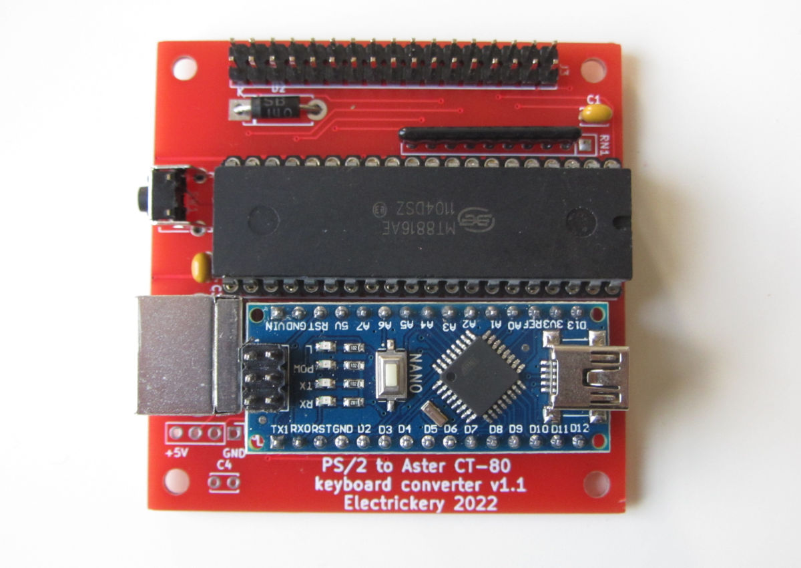

# PS/2 keyboard to matrix converter for the Aster CT-80 computer

A recently aquired vintage computer came without the keyboard. As this is 
a simple 8x8 matrix, and the PS/2 keyboard protocol is supported by the
Arduino environment, is should be simple to fix. This solution uses a
Arduino Nano to interpret the PS/2 keyboard and convert it to an address
for the MT8816 Analog Switch Array having a 16x8 matrix. The required
matrix is only 8x8, so a smaller array might also work, but the MT8816 
was easier to obtain.

The hardware side of the Aster keyboard is very similar to the Tandy 
Radio Shack models 3 and 4, so board and firmware could be used for these
computers too, with minimal changes. More info on this after I tested this 
on my Model 4P.

The KiCAD files of the next version of the board will be added later. The
v1.0 has too many bugs to release.

The CT-80 computer is a specific application of the PS/2 to matrix 
solution, but it could be applied to other computers using a keyboard 
matrix. Keyboard matrices are typical for vintage home computers.

A table is used to convert ASCII to matrix coordinates and another small 
one to fix the out of order addressing in the MT8816.

The sketch attempts to convert from PS/2 to ASCII and from there to the
computer specific matrix. Quite a lot of special cases are needed to get
all characters properly shifted or unshifted.

For two keys the match is not exact:

- The BREAK key is mapped to the PS/2 End key. PS/2 Pause/Break is not 
regular as the make and break codes are the same.
- The CLEAR key has no proper PS/2 equivalent. The PS/2 Home key is used.
Its behaviour is to clear the screen and place the cursor in the upper left
of the screen.

All non-TRS-80 keys are currently unmapped. The CT-80 has some more, but 
these aren't used in BASIC. So I couldn't test them for now...

The sketch prints lots of debug data to the Arduino console, and a simple
command processor is included to test the MT8816 outputs. The current 
commands:

    Cnn - close crosspoint nn
    Onn - open crosspoint nn
    H   - this help
    R   - reset MT8816

### Remarks on version 1.1 of the board

Boards usually come with their design faults, but for this version it is acceptable:

- Diode D1, (below the Arduino) should be replaced by a shorting wire.

- The resistor array uses only eight of the nine resistors, but unfortuneately has 
to be a ten pin array. A 9 pin array can be used but must be mounted on pins 2 to 
10, and a short has to be made between pin 1 and 2.

### Remarks on version 0.6 of the firmware

More key transformations are now done with a table instead of an endless list of 'if' 
statements. These are the 'plain-special' keys. The remainder are 'shifted-special' keys
which require an implicit SHIFT or an un-SHIFT. Restructuring is prepared for these too, but
not implemented yet.

### Simple test for correct operation

The board and firmware can be tested from the Arduino IDE, right after programming, requiring
only a multi-meter:

- Open the Serial Monitor set baud rate to 115200 BAUD. The prompt 
 "PS2Keyboard to Aster CT-80 matrix V0.6" should appear.
 
- Type ? &lt;Enter&gt;. The help text should appear.

- Find pin 1 and 2 from the flat-cable header. These are at the top of the header, next to 
  the text "J3".

- Measure the resistance between the pins with and multi-meter. This should be very high, 
  out of reach of most devices.

- Type C00 &lt;Enter&gt; (One letter, two numbers)

- Measure the resistance between the pins. This should in the range of 100 ohm.

- Type O00 &lt;Enter&gt; (One letter, two numbers)

- Measure the resistance between the pins. This should be very high, out of reach of most 
  devices.

The first number is the column, the second the row. The former ranges from 0 to 7, the latter 
from 0 to F (entry in hex), but only the first eight are wired to the header.
