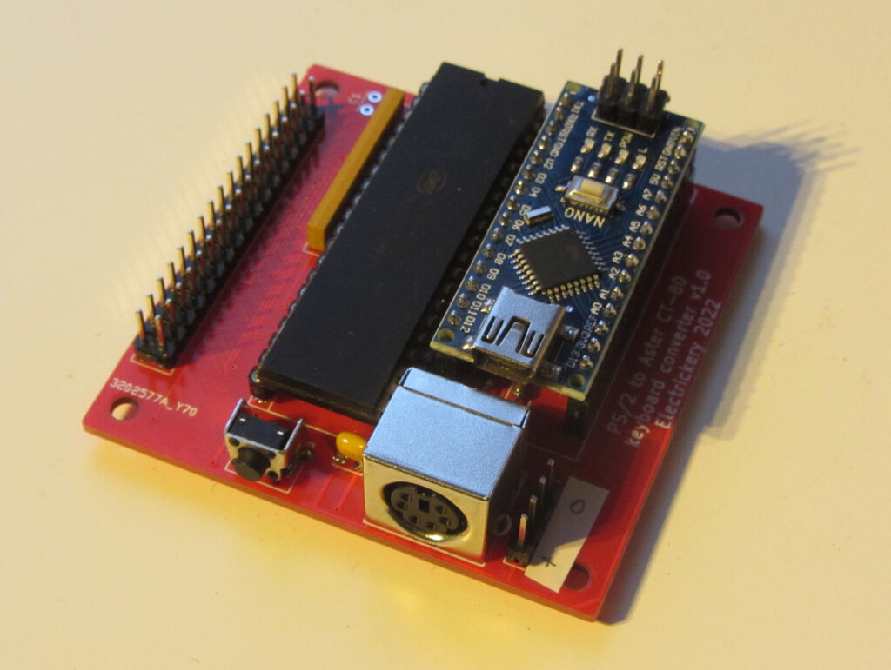

** PS/2 keyboard to matrix converter for the Aster CT-80 computer

A recently aquired vintage computer came without the keyboard. As this is 
a simple 8x8 matrix, and the PS/2 keyboard protocol is supported by the
Arduino environment, is should be simple to fix. This solution uses a
Arduino Nano to interpret the PS/2 keyboard and convert it to an address
for the MT8816 Analog Switch Array having a 16x8 matrix. The required
matrix is only 8x8, so a smaller array might also work, but the MT8816 
was easier to obtain.

The KiCAD files of the next version of the board will be added later. The
v1.0 has to many bugs to release.

The CT-80 computer is a specific application of the PS/2 to matrix 
solution, but it could be applied to other computers using a keyboard 
matrix. Keyboard matrices are typical for vintage home computers.

A table is used to convert ASCII to matrix coordinates and another small 
one to fix the out of order addressing in the MT8816.

The sketch attempts to convert from PS/2 to ASCII and from there to the
computer specific matrix. Quite a lot of special cases are needed to get
all characters properly shifted or unshifted.

The sketch prints lots of debug data to the Arduino console, and a simple
command processor is included to test the MT8816 outputs.

    Cnn - close crosspoint nn
    Onn - open crosspoint nn
    H   - this help
    R   - reset MT8816
